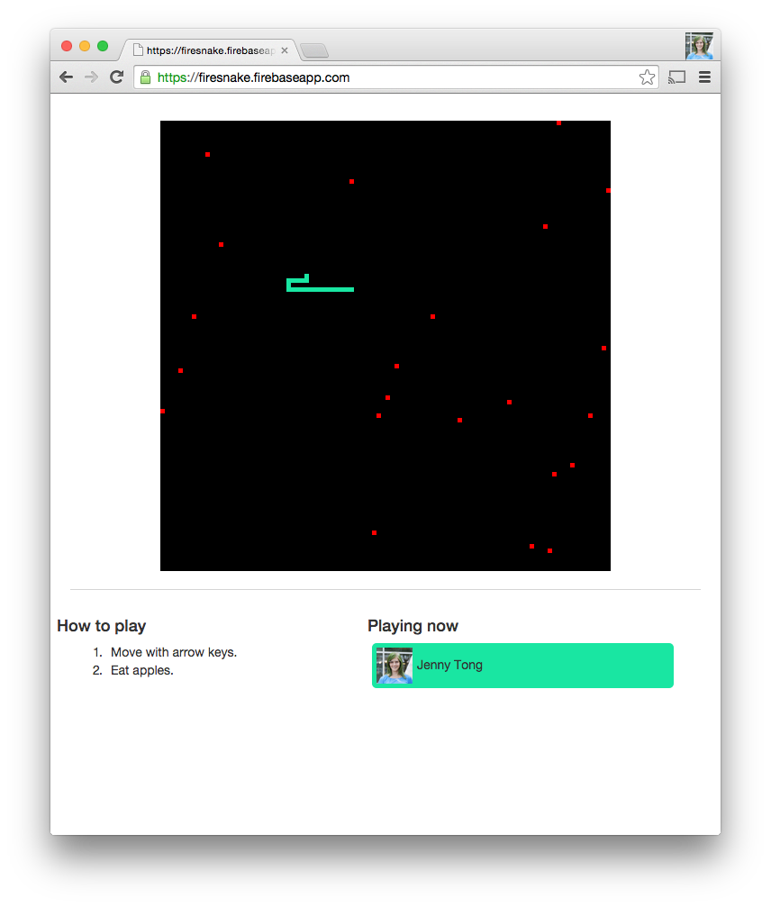

# Firesnake Codelab

Hi there. Welcome to the Firebase codelab! In this codelab I'm going to show
you how easy it is to add multiplayer features to almost anything. Firebase
works for projects big and small, but I know you want to do the other code labs
too. I'm going to keep it quick. You'll probably be done in about an hour. 

Do you may remember a game called Snake? The one where you control a snake who
loves to eat apples? You might have played it on an older cell phone, like the
Nokia 5190. This codelab guides you through writing a massively multiplayer
clone of that gaming classic.

You start with a simple single-player game written in JavaScript. Over a series
of steps you will use Firebase to transform it into the massively multiplayer
version of the same game! 

# Prerequisites

You need these things to do this codelab:

  * A web browser. I tested it with [Chrome](https://www.google.com/intl/en/chrome/browser/desktop/index.html) and [Firefox](https://www.mozilla.org/en-US/firefox/new/).
  * A text editor
  * Basic knowledge of JavaScript and [jQuery](http://jquery.com/)
  * The npm package manager, part of [node.js](http://nodejs.org/download/) (for installing [Firebase command line tools](https://www.firebase.com/docs/hosting/command-line-tool.html))

# Step 0: Serpentine Foundations

Before you dive into the code, spend a few minutes and get to know the project
you're working on and the basics of Firebase.

  1. Play a round on the [live demo](https://firesnake.firebaseapp.com) of the complete codelab. This is what you'll have at the end of step 5.
  2. Sign up for a [Firebase account](https://www.firebase.com/signup/). It will create a Firebase for you automatically, but you can create another
if you'd like a better name.
  3. Learn the basics of Firebase. Run through one of the 5 minute Firebase
quickstarts: [Web](https://www.firebase.com/docs/web/quickstart.html), [Android](https://www.firebase.com/docs/android/quickstart.html), or [iOS](https://www.firebase.com/docs/ios/quickstart.html). I recommend Web, since it's the most applicable to this code lab, but any of
them will do.
  4. Clone the GitHub repository for this code lab: [https://github.com/firebase/firesnake](https://github.com/firebase/firesnake). If you don't have git, you can download the [zip file](https://github.com/firebase/firesnake/archive/master.zip).
  5. Open /step-0/index.html in your favorite web browser.
  6. Fire up your favorite IDE or text editor and open <code>/step-0/index.html</code>. Here's a brief tour of what's in that file.
     * Lines 1 to 14 contain the HTML header that include jQuery and Bootstrap. You
can find the rest of the HTML for the game at the bottom of the file.
     * Lines 17 to 23 define some constants that regulate the size and timing of the
game.
     * Lines 26 to 32 set up some global state used during game execution.
     * Lines 34 to 56 define input handlers and a function that creates a new player.
     * Lines 59 to 60 start the game execution.
     * Most of the game is defined in <code>gameLoop()</code> that runs from line 62 to 195. It processes input, moves the player snake,
spawns apples, detects collisions, and then renders the frames to a canvas. It
executes once per frame.
     * The rest of the file defines a few utility functions used in <code>gameLoop()</code>, like a function to find an empty space to spawn apples and new players.

# Step 1: Share it with the world via Firebase Hosting

Multiplayer games are most fun when other players can join your game.
Deployment is usually the last step, but let's flip that process on it's head
and deploy it to production in the very first step.

  1. Install [node.js](http://nodejs.org/download/), if you haven't already. Verify that you can run the <code>[npm](https://www.npmjs.com/)</code> command.
  2. Install Firebase command line tools by following step one on the [Firebase Hosting Quickstart](https://www.firebase.com/docs/hosting/quickstart.html).
  3. Initialize your project and deploy the one player app to hosting by following
the rest of the steps in the [Firebase Hosting Quickstart](https://www.firebase.com/docs/hosting/quickstart.html).
  4. Navigate to https://&lt;your-firebase&gt;.firebaseapp.com to see your deployed,
publicly accessible game!

If things aren't working, check out the contents of <code>/step-1</code>. Note the addition of <code>firebase.json</code>. This file tells the Firebase command line tools how to deploy your app.

# Step 2: Wire it up to Firebase

Multiple people can now access your game over the web and play it, but everyone
has their own individual game. That's no fun!  With minimal code changes
Firebase can keep all clients in sync with a shared game state.

Change the game to persist the state held in <code>gameState</code> and <code>playerState</code> in Firebase. I'm going to leave the specific code changes as a challenge to
you, but here is list of the changes that you should make:

  1. Include [firebase.js](https://www.firebase.com/docs/web/guide/setup.html)
  2. Create [references](https://www.firebase.com/docs/web/guide/understanding-data.html#section-creating-references) to two locations in Firebase: <code>/game</code> for game state, and <code>/player</code> for player state.
  3. Add [value listeners](https://www.firebase.com/docs/web/guide/retrieving-data.html#section-event-types) that read these references and copy them to the <code>gameState</code> and playerState local variables.
  4. Player state changes often in the game loop. While you could write each change
to Firebase directly, it's probably easier to work on the cached data and use
the [set method](https://www.firebase.com/docs/web/guide/saving-data.html#section-set) to write playerState back to Firebase after each change. Make this change at
appropriate locations in <code>gameLoop()</code>.
  5. When the snake dies, the game ends. In preparation for supporting many players,
remove the <code>gameState.running</code> flag that stops execution.
  6. 'Each time an apple is spawned, use the <code>[push method](https://www.firebase.com/docs/web/guide/saving-data.html#section-push)</code> to add it to Firebase. This should replace the array push operations that
change the cached data model. 
  7. Likewise, remove apples from Firebase when a snake eats them. The [remove method](https://www.firebase.com/docs/web/api/firebase/remove.html) works great for this.
  8. Deploy the updated game. Access it from two tabs. Surprisingly, it's playable.
You can control the game from either tab, but the game behaves strangely with
two instances of <code>gameLoop()</code> running. You technically have a multiplayer game. Great work!

<strong>Note:</strong> If you'd like to run the game from your laptop, you will need to access it
over a local web server. URLs that begin with <code>file://</code> do not work with Firebase for security reasons. If you need a local HTTP
server, install [simplehttpserver](https://www.npmjs.com/package/simplehttpserver).

If things aren't working, check out the contents of <code>/step-2</code>. You can diff <code>/step-2/index.html</code> against <code>/step-1/index.html</code> to see a full list of the changes that I made in this step.

# Step 3: Get to know your users with Google Sign-In

At this point many players can come together to join our game. That's great!
But who are these people? The Internet can be a crazy place. In this step you
will add authentication to your game. Players will be required to sign in to
play the game.

<strong>Note:</strong> This step guides you through using Google Sign-In, but Firebase supports [many other authentication methods](https://www.firebase.com/docs/web/guide/user-auth.html#section-providers). The steps are pretty much the same for other providers. You can even use our [token generators](https://www.firebase.com/docs/web/guide/login/custom.html#section-rest-token-generation) to integrate it with an existing login system! Feel free to diverge a bit in
this step if you'd prefer to authenticate players with [email & password](https://www.firebase.com/docs/web/guide/login/password.html), [Facebook](https://www.firebase.com/docs/web/guide/login/facebook.html), or allow [anonymous users](https://www.firebase.com/docs/web/guide/login/anonymous.html).

  1. Create a new Google application on the [Google Developers Console](https://pantheon.corp.google.com). Follow the steps to [configure your Firebase for Google Sign-in](https://www.firebase.com/docs/web/guide/login/google.html#section-configure) on the Google Authentication guide in the Firebase docs. This involves pasting
values between a couple of forms.
  2. Add a click handler to the Sign in with Google button at the bottom of the
game. Have it call <code>ref.authWithOAuthPopup()</code> to sign in your user as described [here](https://www.firebase.com/docs/web/guide/login/google.html#section-logging-in).
  3. Add an <code>onAuth()</code> handler. This handler is called whenever your user reloads the page, or their
authentication state changes.  Store the user data [in Firebase](https://www.firebase.com/docs/web/guide/user-auth.html#section-storing) at the <code>/users</code> path. Also, cache it in a variable.
  4. Add a <code>child\_added</code> listener to that displays the currently playing users and their pictures at
the bottom of the page under "Playing now"
  5. Add a [disconnect handler](https://www.firebase.com/docs/web/guide/offline-capabilities.html#section-presence) to remove a user's entry from Firebase and the "Playing now" list.
  6. Deploy your app to Firebase Hosting. Play a game.

The game should play just like the end of Step 2, except signed in users are
displayed in the "Playing now" list. You'll use these identities in the next
step to make the game truly MMO.

If things aren't working, check out the contents of <code>/step-3</code>. You can diff <code>/step-3/index.html</code> against <code>/step-2/index.html</code> to see a full list of the changes that I made in this step.

# Step 4: Ready, Set, MMO

Wouldn't this game be a lot more fun if each user had their own snake? In this
step you'll refactor the game logic to create a different snake for each
player.

  1. Each player gets a snake. This means your <code>/users</code> and <code>/player</code> paths are redundant. Merge them into a single <code>/players</code> path such that each user has it's own snake data.
  2. Update <code>gameLoop()</code> to only update the snake state for the current player. There are lots of ways
you can do this. I copied the current player's state into a local variable to
minimize the amount of code that had to be changed.
  3. Update the collision code to detect collisions with other snakes.
  4. Update the draw code to draw all snakes.
  5. Update the getPlayerHue() function to display a different color each user. I
used a modulus hack to extract a consistent color from each player's uid.
  6. Deploy your app to Firebase Hosting. Play a game. Invite your friends, or open
multiple browsers with different Google accounts. 

Great work! You now have a real MMO game in under 300 lines of code. Pretty
cool, isn't it?

If things aren't working, check out the contents of <code>/step-4</code>. You can diff <code>/step-4/index.html</code> against <code>/step-3/index.html</code> to see a full list of the changes that I made in this step.

# Step 5: Keep Firebase Consistent with Security Rules

Our game works great, but it's a bit like the wild west. Anyone can write any
value to Firebase. In this step you'll create [security and validation rules](https://www.firebase.com/docs/security/guide/understanding-security.html). These rules are written in a special declarative language with syntax similar
to JavaScript. They rules keep the data in your Firebase consistent, and
restrict access to the correct users. 

  1. Spend a few minutes trying to hack your own game with the Firebase Dashboard or
your web browser's development tools. What happens if you set a snake to a
negative location? What happens if you delete another player's snake?
  2. Remember that quick start you read in step 1? It's time to do another on. Read
through the [Security & Rules Quickstart](https://www.firebase.com/docs/security/quickstart.html) to get a primer on this topic.
  3. Create a security rule that only allows authenticated users to write to the
apples.
  4. Write a security rule that prevents a user from editing another user's player
object.
  5. Write a validation rule that restricts each player's <code>snakeDirection</code> to <code>n</code>, <code>s</code>, <code>e</code>, or <code>w</code>.
  6. Write validation rules that restrict snake pieces to locations on the game
board.
  7. Come up with one more security rule that you'd like to add to your Firebase.
Write it.
  8. Test your rules using the 'Simulator' tab on your Firebase Dashboard.
  9. The interactive editor is a great place to explore your security rules, but for
a real project you probably want to check them into source control. [Firebase Hosting](https://www.firebase.com/docs/hosting/guide/full-config.html#section-advanced-properties) can read your security rules from a file. Save your rules to <code>security-rules.json</code> and configure them to be deployed when you publish your app with <code>firebase deploy</code>.
  10. Deploy your game. Invite your friends to join you for a game.

With the addition of these rules, your game will stay consistent, and players
can't meddle as easily. The rules you just wrote are far from complete. If you
were going to launch this game for real, you would want to write more.

If things aren't working, check out the contents of <code>/step-6</code>. All of the changes were made in <code>security-rules.json</code> and <code>firebase.json</code>.

# Conclusion

I hope you enjoyed this code lab. You built a multiplayer game in about an
hour. Great work!

This code lab only covered the most basic features of Firebase. I encourage you
to explore further. Firebase also has all of this cool stuff:

  * SDKs for [iOS](https://www.firebase.com/docs/ios/) and [Android](https://www.firebase.com/docs/android/)
  * A [REST API](https://www.firebase.com/docs/rest/) with [streaming](https://www.firebase.com/docs/rest/guide/retrieving-data.html#section-rest-streaming)
  * [Easy to use bindings](https://www.firebase.com/docs/web/libraries/) to popular web frameworks including [AngularJS](https://www.firebase.com/docs/web/libraries/angular/), [Ember](https://www.firebase.com/docs/web/libraries/ember/), and [ReactJS](https://www.firebase.com/docs/web/libraries/react/).
  * Drop in components for [chat](https://github.com/firebase/firechat), [collaborative writing](https://github.com/firebase/firepad), and [geographical queries](https://github.com/firebase/geofire).
  * Helpful, friendly [support](https://www.firebase.com/docs/help/), even if you're using our free plan.

And tons more!

I hope you enjoyed this codelab. If you have any questions, or want to show me
something cool you've developed, please drop me an [email](mailto:jen@firebase.com).